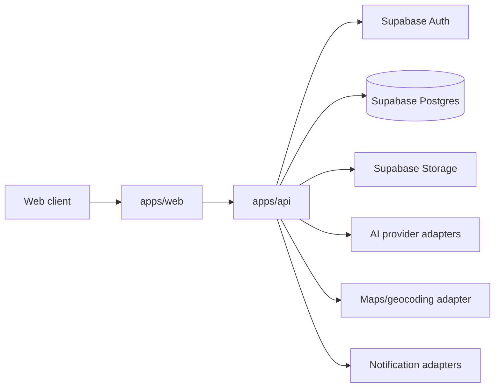

# SAMADHAN Architecture

## System Shape

SAMADHAN is a role-aware web platform with a web client, an API service, Supabase for identity and persistence, object storage for uploads, and isolated AI providers behind server-side interfaces.



## Repository Boundaries

```text
apps/
  web/          Role-aware frontend and public pages
  api/          HTTP API, workflows, validation, integrations
packages/
  config/       Shared configuration and environment parsing
  types/        Shared domain types and API contracts
  ui/           Reusable accessible UI primitives
  validation/   Shared schemas and input rules
supabase/
  migrations/   Versioned SQL migrations
  seed/         Safe development fixtures
docs/           Product and engineering documentation
```

The web client never owns authorization decisions. The API and database policies enforce access. Shared packages may define contracts, but domain rules belong to the API or database layer.

## Core Data Ownership

| Concern                         | Owner                                        |
| ------------------------------- | -------------------------------------------- |
| Session and identity            | Supabase Auth                                |
| User role and profile           | `profiles` and role tables                   |
| Problem lifecycle               | API workflow plus `problems`                 |
| Priority and AI recommendations | Versioned service results plus audit records |
| Files                           | Supabase Storage with database metadata      |
| Notifications                   | API event handlers and notification records  |
| Material actions                | Audit log                                    |

## Request Flow

1. The browser sends a request with the Supabase access token.
2. The API verifies the token and resolves the user role from trusted claims or database state.
3. The API validates input and checks workflow permissions.
4. The API reads or writes data through the authorized service boundary.
5. Material changes create an audit record and may emit notifications.
6. AI or external integrations are called only from server-side adapters.
7. The API returns a stable response envelope to the client.

## Architectural Rules

- Keep business workflows explicit and testable; do not hide them in UI components.
- Use database migrations for every schema change.
- Use UUIDs for public identifiers and avoid exposing sequential internal keys.
- Store timestamps in UTC and render them in the user locale.
- Treat status transitions as a state machine with allowed edges.
- Keep external providers replaceable through interfaces and adapters.
- Prefer idempotent commands for submission, approval, matching, and notification operations.
- Do not place service-role keys or AI provider credentials in the browser.

## Key State Machines

### Problem

`submitted -> under_review -> validated -> prioritized -> assigned -> in_progress -> resolved -> closed`

Additional exits such as `rejected`, `duplicate`, and `archived` require a reason and an audit event.

### Project

`draft -> submitted -> approved -> active -> review -> completed`

Cancellation or rejection requires an actor, reason, and timestamp.

## Architectural Decision Records

For material decisions, add an ADR section or a separate `docs/adr/ADR-NNN-title.md` containing context, decision, alternatives, consequences, and migration plan. Update this document's rules when the decision changes a platform-wide boundary.
