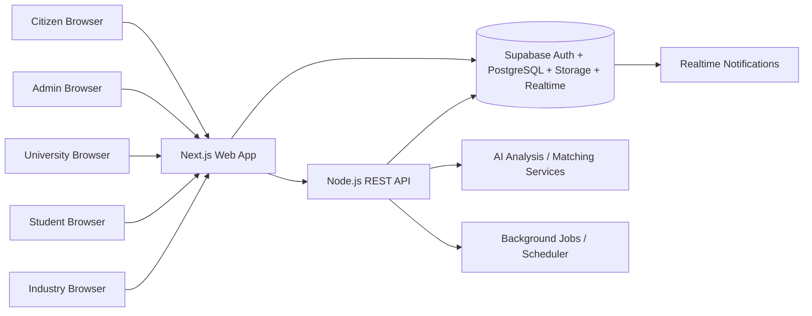
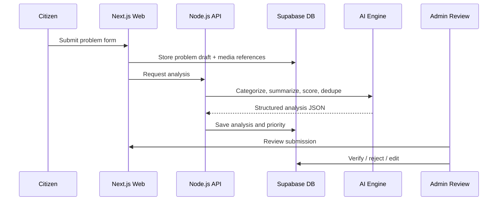
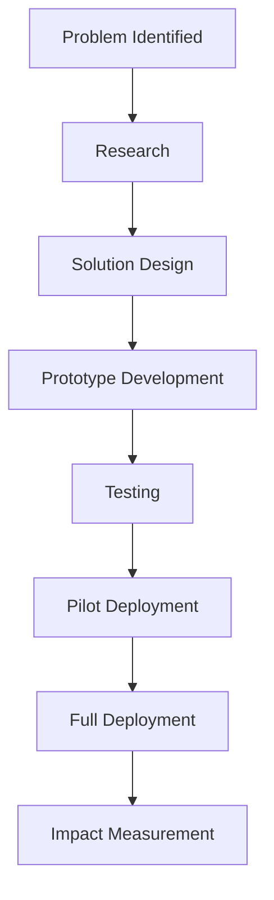

# SAMADHAN Technical Documentation

Tagline: From Citizen Problems to Real-World Solutions

## 1. Executive Summary

SAMADHAN is an AI-assisted civic innovation platform that turns citizen-reported problems into verified, prioritized, matched, and tracked solution initiatives.

The platform connects:

- Citizens who report real-world issues
- Government/Admin teams who verify and prioritize problems
- Universities that accept innovation challenges
- Students and Faculty/Mentors who form solution teams
- Industry Partners who contribute funding, tools, expertise, and deployment support

The core value is not complaint collection. It is structured problem intelligence, human verification, institution matching, project execution, and social impact tracking until the issue is actually resolved.

Recommended implementation choices:

- Frontend: Next.js, React, Tailwind CSS
- Backend: Node.js REST API for privileged workflows and AI orchestration
- Database/Auth/Storage: Supabase with PostgreSQL, Auth, Storage, RLS, and Realtime
- Monorepo: npm workspaces or Turborepo
- Deployment: Hostinger VPS for web and API, Supabase managed backend

## 2. Product Vision

SAMADHAN should evolve every citizen report into an innovation challenge with measurable outcomes.

Vision statement:

> We do not just collect problems. We understand them, prioritize them, connect them with the right institutions and innovators, and track solutions until real-world impact is achieved.

Example transformation:

- Citizen input: "There is contaminated drinking water in our village."
- AI interpretation: Water and Sanitation, Drinking Water Quality, high severity, high priority
- Admin verification: Valid issue requiring action
- University recommendation: Institutions with water, environmental, and IoT expertise
- Challenge creation: A structured innovation challenge with outcomes, timeline, budget, and success criteria
- Project execution: Student and faculty team develops, tests, and deploys a solution
- Impact tracking: Availability, quality, and community feedback are measured after deployment

## 3. Problem Statement

Government grievance systems often fail because they:

- Store complaints without understanding them
- Lack deduplication and prioritization
- Do not connect issues to problem solvers
- Do not support project execution or impact measurement
- Create weak feedback loops for citizens

SAMADHAN addresses these gaps by combining:

- AI problem understanding
- Human verification
- Institution matching
- Collaborative project management
- Outcome and impact tracking

## 4. Solution Overview

SAMADHAN works as a pipeline:

1. Citizen submits a problem with text, location, and media
2. AI analyzes the problem and produces structured insights
3. Duplicate and similar problems are detected
4. Priority is calculated with a transparent scoring model
5. Admin verifies, edits, or rejects the issue
6. Relevant universities are recommended
7. University accepts the challenge
8. Student and faculty team is formed
9. Project is created and tracked through milestones
10. Industry partners can collaborate
11. Prototype, testing, and deployment are managed
12. Impact is measured after deployment
13. Citizen sees live progress and final outcome

## 5. User Roles

| Role                     | Description                                            | Core Permissions                                                                            | Dashboard Focus                        |
| ------------------------ | ------------------------------------------------------ | ------------------------------------------------------------------------------------------- | -------------------------------------- |
| Citizen                  | Reports civic problems and follows progress            | Create problems, upload media, view own submissions, track status, receive notifications    | Submission status, timeline, updates   |
| Government/Admin         | Verifies problems, controls workflows, monitors impact | Review/verify/reject/edit problems, adjust priority, assign universities, manage dashboards | Operations, analytics, approvals       |
| University Administrator | Manages university profile and accepted challenges     | View/review challenges, accept/reject, assign faculty, manage project capacity              | Challenges, university projects        |
| Student                  | Works on assigned projects                             | View assigned projects, manage tasks, upload work products, comment, collaborate            | Tasks, team workspace                  |
| Faculty/Mentor           | Guides project execution                               | Mentor teams, review progress, approve milestones, comment, report progress                 | Mentorship, milestones, project health |
| Industry Partner         | Supports projects with funding, tools, or expertise    | Discover opportunities, express interest, fund, mentor, provide resources                   | Opportunities, partnerships            |

### Role Permissions by Capability

| Capability                     | Citizen | Admin | University Admin | Student | Faculty | Industry |
| ------------------------------ | ------: | ----: | ---------------: | ------: | ------: | -------: |
| Create problem                 |     Yes |   Yes |               No |      No |      No |       No |
| Read public problems           | Limited |   Yes |              Yes |     Yes |     Yes |      Yes |
| Read own data                  |     Yes |   Yes |              Yes |     Yes |     Yes |      Yes |
| Verify problem                 |      No |   Yes |               No |      No |      No |       No |
| Edit verified problem metadata |      No |   Yes |          Limited |      No |      No |       No |
| Assign university              |      No |   Yes |               No |      No |      No |       No |
| Create project                 |      No |   Yes |              Yes | Limited | Limited |       No |
| Update milestones              |      No |   Yes |              Yes |     Yes |     Yes |       No |
| Upload files                   |     Yes |   Yes |              Yes |     Yes |     Yes |      Yes |
| View analytics                 |      No |   Yes |          Limited |      No |      No |  Limited |

## 6. User Journeys

### 6.1 Citizen Journey

1. Citizen registers and logs in
2. Citizen submits a problem with media and location
3. System generates a unique problem ID
4. AI analyzes the issue and suggests category, severity, and priority
5. Admin reviews and verifies the submission
6. Citizen receives status updates
7. Citizen tracks university assignment, project progress, and impact

### 6.2 Admin Journey

1. Admin reviews pending submissions
2. Admin checks AI analysis and duplicates
3. Admin verifies, rejects, or requests more information
4. Admin assigns or recommends a university
5. Admin monitors project progress and impact metrics

### 6.3 University Journey

1. University admin reviews innovation challenges
2. University accepts a challenge
3. Faculty and students are assigned
4. A project workspace is created
5. The team builds, tests, and deploys a solution

### 6.4 Student Journey

1. Student joins the university workspace
2. Student views available projects and tasks
3. Student uploads deliverables and progress updates
4. Faculty reviews and approves progress

### 6.5 Industry Journey

1. Industry partner browses active opportunities
2. Industry partner selects a project to support
3. They provide funding, tools, mentorship, or manufacturing support
4. Their participation is logged and visible in the project timeline

## 7. Complete Feature List

### Core Platform

- Authentication and role-based access control
- Profile management
- Problem reporting
- Media upload
- AI problem intelligence
- Duplicate detection
- Priority scoring
- Human verification
- University matching
- Challenge creation
- Project lifecycle management
- Team collaboration
- Industry collaboration
- Citizen tracking
- Analytics dashboards
- Geographic problem map
- Social impact measurement
- Notifications and activity logs

### Advanced Features

- Voice problem reporting
- Realtime status updates
- Semantic search across problems
- Duplicate cluster visualization
- Manual override for AI outputs
- University capacity scoring
- Project document versioning
- Impact before/after comparisons
- District and category analytics

## 8. System Architecture

### High-Level Architecture



### Core Design Decisions

- Next.js handles the public site, authenticated dashboards, and role-based UI
- Supabase manages identity, data, storage, and row-level security
- Node.js API handles privileged orchestration, AI jobs, matching logic, and batch processes
- The frontend should avoid direct privileged access and rely on RLS plus backend service calls for sensitive actions

### Problem Submission Flow



## 9. Monorepo Architecture

Recommended structure:

```text
samadhan/
  apps/
    web/
    api/
  packages/
    ui/
    database/
    config/
    utils/
  docs/
  package.json
  README.md
```

### Workspace Responsibilities

| Workspace         | Responsibility                                                        |
| ----------------- | --------------------------------------------------------------------- |
| apps/web          | Next.js frontend, dashboards, forms, maps, public pages               |
| apps/api          | Node.js REST API, AI orchestration, batch jobs, privileged workflows  |
| packages/ui       | Shared design system, components, layout primitives                   |
| packages/database | Supabase clients, typed database helpers, query utilities             |
| packages/config   | Shared ESLint, TypeScript, Tailwind, environment schema, constants    |
| packages/utils    | Shared helpers for validation, formatting, dates, scoring, file logic |

### package.json Strategy

- Root `package.json` manages workspaces and shared scripts
- Each app/package owns its own dependencies when they are not shared
- Use `npm run dev`, `npm run build`, `npm run lint`, `npm run test`
- Keep shared config versions centralized where possible

## 10. Frontend Architecture

### Technology Choices

- Next.js App Router
- React 18+
- JavaScript
- Tailwind CSS
- Reusable UI in `packages/ui`
- Supabase client integration for auth, uploads, and realtime

### Frontend Structure

| Layer      | Responsibility                                           |
| ---------- | -------------------------------------------------------- |
| App routes | Page composition and route protection                    |
| Components | Cards, tables, charts, forms, maps, timelines            |
| Hooks      | Session, role, pagination, upload, analytics queries     |
| State      | Server state via fetch/RSC/query cache; UI state locally |
| Validation | Form validation with schema-based rules                  |

### Recommended Frontend Patterns

- Use server components for read-heavy pages when appropriate
- Use client components for forms, maps, drag-and-drop, and realtime sections
- Use a shared role guard for dashboard routes
- Normalize API responses into reusable view models
- Keep problem tracking UI timeline-first and status-driven

### Important Frontend Pages

- Landing page
- About
- How It Works
- Innovation Challenges
- Citizen dashboard
- Problem report form
- Problem details
- Admin dashboard
- AI review screen
- University matching screen
- Project workspace
- Industry collaboration screens

## 11. Backend Architecture

### Responsibilities of apps/api

- Authenticated REST endpoints for privileged actions
- AI analysis orchestration
- Duplicate similarity computation
- Priority scoring and explanation generation
- University matching and ranking
- Notifications and activity logging
- Scheduled jobs for reminders, stale reviews, and impact updates

### Backend Design Principles

- Keep AI advisory only; humans make final decisions
- Validate all payloads
- Do not trust client role claims alone
- Use Supabase service role only on the server
- Use transaction-safe writes for problem verification and project creation

### Suggested Node.js Stack

- Fastify or Express
- Zod or Joi validation
- Supabase server client
- Queue/scheduler integration if needed
- Structured logging

## 12. Supabase Architecture

### Supabase Components

- Authentication: signup/login/logout/session management
- PostgreSQL: primary relational database
- Storage: problem media, project media, documents, avatars
- Row Level Security: access control by role and ownership
- Realtime: status updates and notifications

### Data Ownership Model

- Citizen owns submitted problems
- Admin owns verification workflow
- University owns accepted challenges and project execution
- Team members own their collaboration artifacts by membership
- Industry partners own their collaboration requests and profile content

### Storage Buckets

| Bucket            | Visibility       | Purpose                             |
| ----------------- | ---------------- | ----------------------------------- |
| avatars           | public or signed | User profile photos                 |
| problem-media     | private          | Citizen uploads for problems        |
| project-media     | private          | Prototype images, videos, documents |
| project-documents | private          | Reports, proposals, deliverables    |
| voice-recordings  | private          | Optional voice submissions          |

Recommended path structure:

```text
problem-media/{problem_id}/images/
problem-media/{problem_id}/videos/
problem-media/{problem_id}/docs/
project-media/{project_id}/images/
project-media/{project_id}/videos/
project-documents/{project_id}/reports/
```

## 13. Database Schema

### Schema Strategy

- Use UUID primary keys
- Store timestamps with `created_at` and `updated_at`
- Use enums or lookup tables for stable statuses
- Keep AI output separate from citizen-submitted source data
- Use audit logs for sensitive operations

### Core Lookup and Identity Tables

| Table                | Purpose                                        | Columns and Data Types                                                                                                                                                                                     | PK / FKs                                         | Index Recommendations                            |
| -------------------- | ---------------------------------------------- | ---------------------------------------------------------------------------------------------------------------------------------------------------------------------------------------------------------- | ------------------------------------------------ | ------------------------------------------------ |
| `roles`              | Defines platform roles and permission metadata | `id uuid`, `name text unique`, `description text`, `permissions jsonb`, `is_system boolean`, timestamps                                                                                                    | PK `id`                                          | Unique index on `name`                           |
| `profiles`           | Stores user profile linked to Supabase Auth    | `id uuid`, `full_name text`, `email text`, `phone text`, `role text`, `organization_name text`, `district text`, `city text`, `state text`, `avatar_url text`, `bio text`, `is_active boolean`, timestamps | PK `id`; FK `id -> auth.users.id`                | Index on `role`, `district`, `organization_name` |
| `problem_categories` | Hierarchical problem taxonomy                  | `id uuid`, `parent_id uuid`, `name text`, `slug text`, `description text`, `default_priority_weight numeric`, timestamps                                                                                   | PK `id`; FK `parent_id -> problem_categories.id` | Unique index on `slug`; index on `parent_id`     |

### Problem Intake Tables

| Table                 | Purpose                                  | Columns and Data Types                                                                                                                                                                                                                                                                                                                                                                                       | PK / FKs                                                                                                            | Index Recommendations                                                                          |
| --------------------- | ---------------------------------------- | ------------------------------------------------------------------------------------------------------------------------------------------------------------------------------------------------------------------------------------------------------------------------------------------------------------------------------------------------------------------------------------------------------------ | ------------------------------------------------------------------------------------------------------------------- | ---------------------------------------------------------------------------------------------- |
| `problems`            | Primary citizen problem record           | `id uuid`, `public_id text unique`, `citizen_id uuid`, `title text`, `description text`, `category_id uuid`, `status text`, `severity text`, `urgency_level text`, `people_affected integer`, `priority_score numeric`, `district text`, `city text`, `state text`, `address text`, `gps_lat numeric`, `gps_lng numeric`, `submitted_source text`, `verified_by uuid`, `verified_at timestamptz`, timestamps | PK `id`; FK `citizen_id -> profiles.id`; FK `category_id -> problem_categories.id`; FK `verified_by -> profiles.id` | Index on `status`, `category_id`, `district`, `priority_score DESC`, `created_at DESC`         |
| `problem_media`       | Media files attached to a problem        | `id uuid`, `problem_id uuid`, `media_type text`, `storage_bucket text`, `storage_path text`, `file_name text`, `mime_type text`, `file_size bigint`, `uploaded_by uuid`, `caption text`, timestamps                                                                                                                                                                                                          | PK `id`; FK `problem_id -> problems.id`; FK `uploaded_by -> profiles.id`                                            | Index on `problem_id`, `media_type`                                                            |
| `problem_locations`   | Location details for geospatial analysis | `id uuid`, `problem_id uuid unique`, `country text`, `state text`, `district text`, `city text`, `village text`, `ward text`, `pincode text`, `latitude numeric`, `longitude numeric`, `geom geography(point,4326)`, `map_source text`, timestamps                                                                                                                                                           | PK `id`; FK `problem_id -> problems.id`                                                                             | GiST index on `geom`; index on `district`, `city`                                              |
| `problem_ai_analysis` | AI-generated structured analysis         | `id uuid`, `problem_id uuid unique`, `model_name text`, `input_hash text`, `category_guess text`, `subcategory_guess text`, `severity_guess text`, `priority_score numeric`, `required_expertise text[]`, `suggested_solution_areas text[]`, `summary text`, `confidence_score numeric`, `analysis_json jsonb`, `error_message text`, timestamps                                                             | PK `id`; FK `problem_id -> problems.id`                                                                             | Unique index on `problem_id`; index on `confidence_score`                                      |
| `problem_duplicates`  | Pairwise similarity records              | `id uuid`, `problem_id uuid`, `similar_problem_id uuid`, `similarity_score numeric`, `text_score numeric`, `location_score numeric`, `category_score numeric`, `date_score numeric`, `review_status text`, `reviewed_by uuid`, `reviewed_at timestamptz`, timestamps                                                                                                                                         | PK `id`; FKs to `problems.id` and `profiles.id`                                                                     | Unique composite index on `(problem_id, similar_problem_id)`; index on `similarity_score DESC` |
| `problem_clusters`    | Groups related duplicate problems        | `id uuid`, `cluster_key text unique`, `representative_problem_id uuid`, `merged_into_problem_id uuid`, `cluster_score numeric`, `cluster_reason text`, `status text`, timestamps                                                                                                                                                                                                                             | PK `id`; FKs to `problems.id`                                                                                       | Index on `status`, `representative_problem_id`                                                 |
| `priority_scores`     | Transparent priority engine output       | `id uuid`, `problem_id uuid unique`, `severity_weight numeric`, `urgency_weight numeric`, `population_weight numeric`, `duplicate_weight numeric`, `geographic_weight numeric`, `social_impact_weight numeric`, `final_score numeric`, `explanation jsonb`, `calculated_at timestamptz`                                                                                                                      | PK `id`; FK `problem_id -> problems.id`                                                                             | Unique index on `problem_id`; index on `final_score DESC`                                      |

### University and Expertise Tables

| Table                  | Purpose                        | Columns and Data Types                                                                                                                                                                                                                                        | PK / FKs                                                                        | Index Recommendations                                              |
| ---------------------- | ------------------------------ | ------------------------------------------------------------------------------------------------------------------------------------------------------------------------------------------------------------------------------------------------------------- | ------------------------------------------------------------------------------- | ------------------------------------------------------------------ |
| `universities`         | University master profile      | `id uuid`, `name text`, `type text`, `website text`, `email text`, `phone text`, `state text`, `district text`, `city text`, `address text`, `latitude numeric`, `longitude numeric`, `capacity_score numeric`, `description text`, `status text`, timestamps | PK `id`                                                                         | Unique index on `name`; index on `district`, `capacity_score DESC` |
| `university_expertise` | Expertise tags for matching    | `id uuid`, `university_id uuid`, `expertise_tag text`, `department text`, `lab_name text`, `weight numeric`, `verified_by uuid`, timestamps                                                                                                                   | PK `id`; FK `university_id -> universities.id`; FK `verified_by -> profiles.id` | Index on `university_id`, `expertise_tag`                          |
| `faculty_profiles`     | Faculty/mentor profile data    | `id uuid`, `profile_id uuid unique`, `university_id uuid`, `designation text`, `department text`, `expertise_tags text[]`, `research_areas text[]`, `office_location text`, `available_for_mentoring boolean`, timestamps                                     | PK `id`; FKs to `profiles.id`, `universities.id`                                | Index on `university_id`, `available_for_mentoring`                |
| `student_profiles`     | Student academic profile       | `id uuid`, `profile_id uuid unique`, `university_id uuid`, `department text`, `year_of_study text`, `skills_summary text`, `skills_tags text[]`, `portfolio_url text`, timestamps                                                                             | PK `id`; FKs to `profiles.id`, `universities.id`                                | Index on `university_id`, `year_of_study`                          |
| `student_skills`       | Normalized student skills      | `id uuid`, `student_profile_id uuid`, `skill_name text`, `proficiency_level text`, `evidence_url text`, timestamps                                                                                                                                            | PK `id`; FK `student_profile_id -> student_profiles.id`                         | Index on `student_profile_id`, `skill_name`                        |
| `industry_partners`    | Industry organization profiles | `id uuid`, `profile_id uuid unique`, `company_name text`, `sector text`, `website text`, `email text`, `city text`, `state text`, `partnership_type text`, `verified_status text`, timestamps                                                                 | PK `id`; FK `profile_id -> profiles.id`                                         | Index on `sector`, `verified_status`                               |
| `industry_expertise`   | Industry support capabilities  | `id uuid`, `industry_partner_id uuid`, `expertise_tag text`, `support_type text`, `capacity_description text`, timestamps                                                                                                                                     | PK `id`; FK `industry_partner_id -> industry_partners.id`                       | Index on `industry_partner_id`, `expertise_tag`                    |

### Challenges, Projects, and Collaboration Tables

| Table                    | Purpose                                           | Columns and Data Types                                                                                                                                                                                                                                                                                                                      | PK / FKs                                                                                                                                           | Index Recommendations                                              |
| ------------------------ | ------------------------------------------------- | ------------------------------------------------------------------------------------------------------------------------------------------------------------------------------------------------------------------------------------------------------------------------------------------------------------------------------------------- | -------------------------------------------------------------------------------------------------------------------------------------------------- | ------------------------------------------------------------------ |
| `innovation_challenges`  | Converted verified problems into challenges       | `id uuid`, `problem_id uuid unique`, `title text`, `problem_summary text`, `location text`, `category_id uuid`, `priority_score numeric`, `required_expertise text[]`, `expected_outcomes jsonb`, `suggested_timeline text`, `estimated_budget numeric`, `success_criteria jsonb`, `status text`, `assigned_university_id uuid`, timestamps | PK `id`; FKs to `problems.id`, `problem_categories.id`, `universities.id`                                                                          | Index on `status`, `priority_score DESC`, `assigned_university_id` |
| `projects`               | Active execution record for an accepted challenge | `id uuid`, `challenge_id uuid unique`, `problem_id uuid`, `university_id uuid`, `industry_partner_id uuid`, `title text`, `current_stage text`, `status text`, `progress_percentage numeric`, `start_date date`, `end_date date`, `lead_faculty_id uuid`, `lead_student_id uuid`, `public_visibility boolean`, timestamps                   | PK `id`; FKs to `innovation_challenges.id`, `problems.id`, `universities.id`, `industry_partners.id`, `faculty_profiles.id`, `student_profiles.id` | Index on `status`, `current_stage`, `progress_percentage DESC`     |
| `project_members`        | Many-to-many project membership                   | `id uuid`, `project_id uuid`, `profile_id uuid`, `member_role text`, `is_active boolean`, `assigned_at timestamptz`, timestamps                                                                                                                                                                                                             | PK `id`; FKs to `projects.id`, `profiles.id`                                                                                                       | Unique index on `(project_id, profile_id)`; index on `member_role` |
| `project_milestones`     | Milestone tracker                                 | `id uuid`, `project_id uuid`, `title text`, `description text`, `order_no integer`, `status text`, `due_date date`, `completed_at timestamptz`, `progress_percentage numeric`, timestamps                                                                                                                                                   | PK `id`; FK `project_id -> projects.id`                                                                                                            | Unique index on `(project_id, order_no)`                           |
| `project_tasks`          | Detailed task management                          | `id uuid`, `project_id uuid`, `milestone_id uuid`, `title text`, `description text`, `assignee_profile_id uuid`, `status text`, `priority text`, `due_date date`, `completion_pct numeric`, timestamps                                                                                                                                      | PK `id`; FKs to `projects.id`, `project_milestones.id`, `profiles.id`                                                                              | Index on `project_id`, `assignee_profile_id`, `status`             |
| `project_documents`      | Versioned files and reports                       | `id uuid`, `project_id uuid`, `storage_bucket text`, `storage_path text`, `file_name text`, `doc_type text`, `version_no integer`, `uploaded_by uuid`, `visibility text`, timestamps                                                                                                                                                        | PK `id`; FKs to `projects.id`, `profiles.id`                                                                                                       | Index on `project_id`, `doc_type`                                  |
| `project_media`          | Images/videos for progress and prototype evidence | `id uuid`, `project_id uuid`, `media_type text`, `storage_bucket text`, `storage_path text`, `uploaded_by uuid`, timestamps                                                                                                                                                                                                                 | PK `id`; FKs to `projects.id`, `profiles.id`                                                                                                       | Index on `project_id`, `media_type`                                |
| `project_updates`        | Status updates and announcements                  | `id uuid`, `project_id uuid`, `update_type text`, `summary text`, `details text`, `posted_by uuid`, timestamps                                                                                                                                                                                                                              | PK `id`; FKs to `projects.id`, `profiles.id`                                                                                                       | Index on `project_id`, `created_at DESC`                           |
| `project_comments`       | Collaboration comments                            | `id uuid`, `project_id uuid`, `parent_comment_id uuid`, `body text`, `posted_by uuid`, `visibility text`, timestamps                                                                                                                                                                                                                        | PK `id`; FKs to `projects.id`, `profiles.id`, self-relation                                                                                        | Index on `project_id`, `parent_comment_id`                         |
| `collaboration_requests` | Requests for university/industry participation    | `id uuid`, `request_type text`, `requester_profile_id uuid`, `target_project_id uuid`, `target_challenge_id uuid`, `message text`, `status text`, `reviewed_by uuid`, `reviewed_at timestamptz`, timestamps                                                                                                                                 | PK `id`; FKs to `profiles.id`, `projects.id`, `innovation_challenges.id`                                                                           | Index on `status`, `request_type`                                  |

### Engagement, Notification, and Audit Tables

| Table            | Purpose                                 | Columns and Data Types                                                                                                                                                                          | PK / FKs                                          | Index Recommendations                                                      |
| ---------------- | --------------------------------------- | ----------------------------------------------------------------------------------------------------------------------------------------------------------------------------------------------- | ------------------------------------------------- | -------------------------------------------------------------------------- |
| `notifications`  | In-app and realtime alerts              | `id uuid`, `recipient_profile_id uuid`, `type text`, `title text`, `body text`, `entity_type text`, `entity_id uuid`, `read_at timestamptz`, timestamps                                         | PK `id`; FK `recipient_profile_id -> profiles.id` | Index on `recipient_profile_id`, `read_at`, `created_at DESC`              |
| `impact_metrics` | Before/after social impact measurements | `id uuid`, `project_id uuid`, `metric_name text`, `before_value numeric`, `after_value numeric`, `unit text`, `beneficiary_count integer`, `measured_at timestamptz`, `source text`, timestamps | PK `id`; FK `project_id -> projects.id`           | Index on `project_id`, `metric_name`                                       |
| `activity_logs`  | Immutable audit log                     | `id uuid`, `actor_profile_id uuid`, `action text`, `entity_type text`, `entity_id uuid`, `metadata jsonb`, `ip_address inet`, `user_agent text`, `created_at timestamptz`                       | PK `id`; FK `actor_profile_id -> profiles.id`     | Index on `entity_type`, `entity_id`, `created_at DESC`, `actor_profile_id` |

### SQL Schema Suggestions

- Create `updated_at` trigger functions for mutable tables
- Use `gen_random_uuid()` for all primary keys
- Add check constraints for score ranges:
  - priority score 0 to 100
  - confidence score 0 to 1 or 0 to 100, but be consistent
- Use foreign key `ON DELETE` carefully:
  - Restrict on operational records
  - Cascade only on non-critical child records such as media metadata where appropriate
- Create search indexes on problem text, category, district, and status
- Use `pg_trgm` for similarity matching if semantic search is implemented with text search support

### Recommended Enums

- `app_role`
- `problem_status`
- `problem_severity`
- `urgency_level`
- `media_type`
- `project_stage`
- `request_status`
- `notification_type`
- `collaboration_type`

## 14. Authentication and Authorization

### Authentication Flow

1. User signs up or logs in using Supabase Auth
2. A profile row is created or updated in `profiles`
3. The `profiles.role` field determines dashboard access
4. RLS policies enforce record ownership and role permissions
5. Backend API performs any privileged service-role actions

### Role Storage Recommendation

- Store the authoritative application role in `profiles.role`
- Mirror user metadata in `roles` for permission definitions and admin management
- Keep `auth.users` focused on identity, not business logic

### Authorization Rules

| Action                    | Citizen | Admin | University | Student | Faculty | Industry |
| ------------------------- | ------- | ----- | ---------- | ------- | ------- | -------- |
| Create problem            | Yes     | Yes   | No         | No      | No      | No       |
| Read own problem          | Yes     | Yes   | Yes        | Yes     | Yes     | Yes      |
| Read any verified problem | Limited | Yes   | Yes        | Yes     | Yes     | Yes      |
| Verify/reject problem     | No      | Yes   | No         | No      | No      | No       |
| Assign university         | No      | Yes   | No         | No      | No      | No       |
| View assigned challenge   | No      | Yes   | Yes        | Yes     | Yes     | Yes      |
| Modify project tasks      | No      | Yes   | Yes        | Yes     | Yes     | Limited  |
| Upload project files      | No      | Yes   | Yes        | Yes     | Yes     | Yes      |
| View analytics            | No      | Yes   | Limited    | No      | Limited | Limited  |

### RLS Strategy

- Citizens can read and update only their own problems before verification
- Admins can read all records necessary for review workflows
- Universities can read only assigned or visible challenges and related projects
- Students/faculty can access projects where they are members
- Industry partners can see public opportunities and their own collaborations
- Sensitive analytics should be aggregated or admin-only

## 15. AI Module Architecture

### AI Responsibilities

- Categorization
- Subcategory detection
- Severity estimation
- Priority recommendation
- Required expertise extraction
- Suggested solution areas
- Summarization
- Duplicate detection
- Similar problem detection

### AI Is Advisory Only

AI outputs must never automatically finalize:

- verification
- rejection
- university assignment
- project creation

Final decisions stay with authorized humans.

### Input Data

- Problem title
- Description
- Category hints
- Location metadata
- Media metadata
- Citizen-submitted urgency
- Historical similar issues
- Submission date
- Optional voice transcription

### Processing Flow

1. Normalize text and metadata
2. Generate summary
3. Predict category and subcategory
4. Estimate severity and urgency
5. Extract expertise and solution areas
6. Compare against historical problems
7. Produce duplicate and similarity candidates
8. Return structured JSON
9. Store raw analysis and confidence information

### Example Output

```json
{
  "category": "Water and Sanitation",
  "subcategory": "Drinking Water Quality",
  "severity": "High",
  "priority_score": 92,
  "required_expertise": [
    "Water Management",
    "Environmental Engineering",
    "IoT"
  ],
  "suggested_solution_areas": [
    "Water quality monitoring",
    "Filtration",
    "IoT monitoring systems"
  ],
  "summary": "Contaminated drinking water has been reported in the village and may affect a large population.",
  "confidence_score": 0.91
}
```

### Fallback Behavior

- If AI fails, store the submission without analysis
- Mark analysis as pending or failed
- Allow admin manual categorization and prioritization
- Retry asynchronously when service returns

### Error Handling

- Timeouts
- Low confidence
- Unsupported input
- Media processing failure
- Rate limiting
- Service unavailable

## 16. Priority Engine

### Transparent Priority Formula

Suggested normalized 0 to 100 score:

`Priority Score = Severity + Urgency + Population Impact + Duplicate Pressure + Geographic Spread + Social Impact`

Suggested weights:

- Severity: 0 to 30
- Urgency: 0 to 20
- Population impact: 0 to 20
- Duplicate report pressure: 0 to 10
- Geographic spread: 0 to 10
- Social impact potential: 0 to 10

### Explanation Requirement

Every score must store why it was assigned:

- High health risk
- Many people affected
- Multiple similar reports
- Multi-village impact
- High social benefit after resolution

## 17. Duplicate Problem Detection

### Matching Signals

- Text similarity
- Semantic similarity
- Location proximity
- Category overlap
- Submission date proximity

### Similarity Score

- 0 to 100 composite score
- Store component scores separately
- Recommend human review when score exceeds a threshold such as 75

### Duplicate Clustering

- Build clusters of related reports
- Select a representative problem
- Keep all source submissions linked
- Do not merge unless admin confirms

### Problem Merging Strategy

- Preserve original reports
- Mark cluster relationships
- Track merged status and reviewer
- Keep audit trail

## 18. University Matching Module

### Match Inputs

- Department expertise
- Faculty research areas
- Labs and facilities
- Previous projects
- Student skill profiles
- Geographic proximity
- Capacity availability

### University Match Score

Recommended 0 to 100 score:

- Expertise match: 35
- Lab/facility match: 15
- Faculty match: 20
- Past project relevance: 10
- Student skill alignment: 10
- Geographic proximity: 5
- Capacity availability: 5

### Recommendation Workflow

1. Filter universities by required expertise
2. Score candidates
3. Rank top matches
4. Show reason codes
5. Allow manual override by admin

## 19. Innovation Challenge Module

Verified problems become innovation challenges with:

- Title
- Problem summary
- Location
- Category
- Priority
- Required expertise
- Expected outcomes
- Timeline
- Estimated budget
- Success criteria

Universities can:

- View challenges
- Accept challenges
- Express interest
- Reject challenges
- Submit proposals

## 20. Student and Faculty Collaboration Module

### Team Structure

- Project Lead
- Students
- Faculty Mentor
- External Mentor

### Features

- Team creation
- Invitations
- Role assignment
- Skill profiles
- Project collaboration
- Task assignment

## 21. Project Lifecycle Workflow



### Project Data

- Milestones
- Tasks
- Timeline
- Progress percentage
- Documents
- Prototype images
- Videos
- Reports
- Comments
- Status updates

## 22. Industry Collaboration Module

### Industry Capabilities

- Discover projects
- View collaboration opportunities
- Provide funding
- Provide mentorship
- Provide technology
- Provide hardware
- Support manufacturing
- Support deployment

### Approval Workflow

1. Industry partner submits collaboration interest
2. Admin or university reviews request
3. Request is approved, rejected, or pending
4. Approved support becomes visible on the project timeline

## 23. Citizen Tracking Module

Citizens should see a timeline such as:

- Problem Submitted
- AI Analysis Completed
- Problem Verified
- University Assigned
- Project Started
- Prototype Development
- Testing
- Deployment
- Completed

Citizens should receive notifications on meaningful state changes only.

## 24. Government/Admin Dashboard

### Dashboard Metrics

- Total problems
- Problems submitted
- Problems under review
- Verified problems
- Active projects
- Completed projects
- Deployed solutions
- Citizens benefited

### Analytics

- Problems by category
- Problems by district
- Problems by status
- Priority distribution
- University performance
- Project progress
- Industry participation
- Social impact

## 25. Geographic Problem Map

### Map Features

- Problem locations
- District analysis
- Category filters
- Priority filters
- Status filters
- Problem density
- Heatmap concept
- Project locations

### Suggested Implementation

- Use GeoJSON or stored latitude/longitude
- Use client-side map rendering for dashboards
- Aggregate server-side for large datasets

## 26. Social Impact Measurement

### Fields

- Number of people benefited
- Before metrics
- After metrics
- Cost
- Project duration
- Community feedback
- Sustainability indicators

### Example

- Before: Water available 2 hours per day
- After: Water available 8 hours per day
- Impact: 300% increase in water availability

## 27. API Documentation

### API Standards

- Use REST
- Return JSON
- Require bearer authentication for protected routes
- Use consistent error envelopes
- Validate all inputs

### Common Error Format

```json
{
  "error": "ValidationError",
  "message": "title is required",
  "details": []
}
```

### Core Endpoints

| Method | URL                              | Auth                                   | Request Body                                   | Response Body                                        | Common Errors      |
| ------ | -------------------------------- | -------------------------------------- | ---------------------------------------------- | ---------------------------------------------------- | ------------------ |
| POST   | `/problems`                      | Citizen/Admin                          | Problem payload + optional location/media refs | Created problem with ID and status                   | 400, 401, 403, 422 |
| GET    | `/problems`                      | Authenticated                          | Query filters                                  | Problem list with pagination                         | 401, 403           |
| GET    | `/problems/:id`                  | Authenticated                          | None                                           | Problem details, media, status, AI output if allowed | 401, 403, 404      |
| PATCH  | `/problems/:id`                  | Owner/Admin                            | Editable problem fields                        | Updated record                                       | 400, 401, 403, 404 |
| POST   | `/problems/:id/analyze`          | Admin/API                              | None or analysis trigger payload               | AI analysis JSON                                     | 401, 403, 409, 500 |
| GET    | `/problems/:id/similar`          | Admin/Reviewer                         | None                                           | Similar problems and scores                          | 401, 403, 404      |
| POST   | `/problems/:id/verify`           | Admin                                  | Verify/reject/request-info payload             | Verification result                                  | 401, 403, 404, 409 |
| GET    | `/universities`                  | Authenticated                          | Query filters                                  | University list                                      | 401                |
| GET    | `/universities/match/:problemId` | Admin                                  | None                                           | Ranked university matches                            | 401, 403, 404      |
| POST   | `/challenges`                    | Admin                                  | Challenge payload                              | Challenge record                                     | 401, 403, 422      |
| GET    | `/challenges`                    | Authenticated                          | Filters                                        | Challenge list                                       | 401                |
| POST   | `/projects`                      | Admin/University                       | Project payload                                | Project record                                       | 401, 403, 422      |
| GET    | `/projects/:id`                  | Authenticated member/public as allowed | None                                           | Project details                                      | 401, 403, 404      |
| POST   | `/projects/:id/milestones`       | Project manager                        | Milestone payload                              | Milestone record                                     | 401, 403, 422      |
| GET    | `/dashboard/analytics`           | Admin                                  | Date range and filters                         | Aggregated analytics                                 | 401, 403           |

### Endpoint Notes

- Problem creation should trigger media linking, unique ID creation, and background AI analysis
- Verification endpoint should write to `activity_logs`
- Match endpoint should expose reasons, not just numeric scores
- Analytics endpoint should return aggregated data only

## 28. Page-by-Page UI Documentation

### Public Pages

| Page                  | Purpose                            | Components                                           | Actions                            | Data Required  | Permissions          |
| --------------------- | ---------------------------------- | ---------------------------------------------------- | ---------------------------------- | -------------- | -------------------- |
| Landing Page          | Explain SAMADHAN and drive sign-up | Hero, CTA, stats, featured challenges, trust section | Sign up, log in, browse challenges | Public content | Public               |
| About Samadhan        | Explain mission and ecosystem      | Mission blocks, role cards, process diagram          | Read-only                          | Public content | Public               |
| How It Works          | Show end-to-end workflow           | Stepper, timeline, FAQ                               | Read-only                          | Workflow data  | Public               |
| Innovation Challenges | Showcase verified challenges       | Filters, cards, search, detail links                 | Open challenge details             | Challenge list | Public/authenticated |

### Citizen Pages

| Page              | Purpose                     | Components                                      | Actions                          | Data Required                           | Permissions     |
| ----------------- | --------------------------- | ----------------------------------------------- | -------------------------------- | --------------------------------------- | --------------- |
| Citizen Dashboard | Overview of submissions     | Stats, timeline, notifications, recent problems | Open problem details             | Own problems and notifications          | Citizen         |
| Report Problem    | Create new problem          | Multi-step form, location picker, media upload  | Submit report                    | Categories, profile, map, upload tokens | Citizen         |
| My Problems       | List owned reports          | Table, filters, status chips                    | Open, filter, resubmit more info | Own problems                            | Citizen         |
| Problem Details   | Show full problem lifecycle | Summary, AI analysis, media, timeline           | View status, comments, updates   | Problem record, media, timeline         | Citizen/allowed |
| Problem Tracking  | Visual progress view        | Timeline, map, updates, notifications           | Follow progress                  | Problem status history                  | Citizen         |

### Admin Pages

| Page                     | Purpose               | Components                         | Actions                      | Data Required              | Permissions |
| ------------------------ | --------------------- | ---------------------------------- | ---------------------------- | -------------------------- | ----------- |
| Admin Dashboard          | High-level operations | KPI cards, queues, charts, map     | Drill down into workflows    | Aggregate analytics        | Admin       |
| Problem Management       | Review queue          | Table, filters, bulk actions       | Verify, reject, edit, assign | Problems, AI output, media | Admin       |
| AI Analysis Review       | Inspect AI outputs    | JSON viewer, reasoning panel       | Accept or override AI        | AI analysis records        | Admin       |
| Duplicate Problem Review | Handle duplicates     | Cluster view, similarity scores    | Merge/mark related           | duplicate records          | Admin       |
| University Matching      | Rank universities     | Score table, reason codes          | Recommend or override        | Universities and expertise | Admin       |
| Project Monitoring       | Track active projects | Milestones, tasks, media, comments | Escalate or adjust           | Projects and team data     | Admin       |
| Analytics                | Deep reporting        | Charts, map, exports               | Export and compare           | Aggregated data            | Admin       |

### University Pages

| Page                   | Purpose             | Components                        | Actions                          | Data Required      | Permissions              |
| ---------------------- | ------------------- | --------------------------------- | -------------------------------- | ------------------ | ------------------------ |
| University Dashboard   | University overview | Challenge summary, project list   | Review recommendations           | University records | University Admin         |
| Recommended Challenges | Browse matches      | Ranked list, filters, reason tags | Accept, reject, express interest | Challenge list     | University Admin         |
| Challenge Details      | Inspect a challenge | Summary, requirements, deadlines  | Accept/propose/reject            | Challenge data     | University Admin         |
| Project Management     | Run accepted work   | Team, milestones, tasks, files    | Update progress                  | Project record     | University Admin/Faculty |

### Student Pages

| Page               | Purpose                  | Components                       | Actions                       | Data Required         | Permissions     |
| ------------------ | ------------------------ | -------------------------------- | ----------------------------- | --------------------- | --------------- |
| Student Dashboard  | Student work center      | Assigned projects, tasks, alerts | Open workspace                | Assigned data         | Student         |
| Available Projects | Discover opportunities   | Filters, cards, skills match     | Request to join               | Project list          | Student         |
| Team Workspace     | Collaboration hub        | Chat/comments, docs, tasks       | Post updates, upload files    | Team and project data | Student/Faculty |
| Tasks              | Personal task management | Kanban/list, due dates           | Complete tasks, update status | Assigned tasks        | Student         |

### Industry Pages

| Page                        | Purpose              | Components                           | Actions                         | Data Required           | Permissions |
| --------------------------- | -------------------- | ------------------------------------ | ------------------------------- | ----------------------- | ----------- |
| Industry Dashboard          | Partnership overview | Stats, saved opportunities, requests | View partnerships               | Industry profile        | Industry    |
| Collaboration Opportunities | Discover projects    | Filters, opportunity cards           | Express interest, offer support | Project list            | Industry    |
| Active Partnerships         | Manage engagements   | Status cards, timeline, support logs | Review progress                 | Approved collaborations | Industry    |

## 29. Security Architecture

### Security Controls

- Supabase RLS on every sensitive table
- Server-side authorization for privileged actions
- Input validation on all endpoints
- File type and size validation before upload
- Secure environment variables
- Rate limiting on auth and public endpoints
- Audit logging for verification and project actions
- Citizen data protection by default

### File Upload Validation

- Restrict file extensions and MIME types
- Enforce size limits
- Store private files in private buckets
- Generate signed URLs when needed
- Scan or inspect risky uploads where possible

### Environment Variable Strategy

- `NEXT_PUBLIC_*` only for public client-safe values
- Never expose Supabase service role keys to the browser
- Store secrets in Hostinger environment config or deployment environment

### Activity Logging

Log sensitive actions such as:

- Verification
- Rejection
- Priority overrides
- University assignment
- Project creation
- Milestone edits

## 30. Deployment Architecture for Hostinger

### Recommended Hostinger Model

Use Hostinger VPS or cloud hosting for the application runtime. This is the best fit for:

- Next.js SSR or hybrid rendering
- Node.js API processes
- Background jobs
- Reverse proxy configuration

### Deployment Components

- `web`: Next.js app
- `api`: Node.js service
- `Supabase`: managed external backend
- `Nginx`: reverse proxy and SSL termination
- `PM2`: process manager for Node services

### Build Process

1. Install dependencies
2. Build shared packages
3. Build web app
4. Build API app
5. Run database migrations if needed
6. Restart services

### Hostinger Environment Variables

| Variable                        | Purpose                                    |
| ------------------------------- | ------------------------------------------ |
| `NEXT_PUBLIC_SUPABASE_URL`      | Client-side Supabase URL                   |
| `NEXT_PUBLIC_SUPABASE_ANON_KEY` | Public Supabase client key                 |
| `SUPABASE_SERVICE_ROLE_KEY`     | Server-only privileged access              |
| `DATABASE_URL`                  | If direct connection is needed server-side |
| `AI_API_KEY`                    | AI provider credentials                    |
| `APP_URL`                       | Primary site URL                           |
| `API_URL`                       | API base URL                               |
| `UPLOAD_MAX_SIZE_MB`            | File size policy                           |

### Domain and HTTPS

- Point the domain to Hostinger VPS
- Configure Nginx to serve web and API subpaths or subdomains
- Use Let’s Encrypt for HTTPS
- Force HTTPS redirects

### Backup Strategy

- Supabase managed backups for PostgreSQL
- Export critical configuration and SQL migration scripts
- Store deployment secrets in a secure vault
- Periodically back up generated documents and uploaded assets

### Error Monitoring

- Structured logs
- Uptime monitoring
- API error alerts
- Frontend error tracking

## 31. Development Roadmap

### Phase 1: MVP

- Authentication
- Citizen problem submission
- Media upload
- AI problem analysis
- Admin verification
- Problem dashboard

### Phase 2

- Duplicate detection
- Priority engine
- University profiles
- University matching

### Phase 3

- Innovation challenges
- Project management
- Student collaboration

### Phase 4

- Industry collaboration
- Impact measurement
- Advanced analytics
- Geographic problem map

## 32. MVP Scope

### Must-Have Features

1. Authentication
2. Citizen problem reporting
3. Image upload
4. Location capture
5. AI problem categorization
6. AI priority recommendation
7. Similar problem detection
8. Admin dashboard
9. University matching
10. Project lifecycle tracking

### Nice-to-Have Features

- Voice reporting
- Advanced GIS heatmaps
- Realtime notifications
- Industry marketplace
- Advanced impact analytics

## 33. Future Scope

- Multi-language support
- Mobile app
- SMS/WhatsApp citizen notifications
- Open data portals
- Predictive issue forecasting
- Advanced geospatial clustering
- Automated policy suggestion reports
- Public transparency dashboards

## 34. Recommended Development Order

1. Set up monorepo, shared config, and environment conventions
2. Implement Supabase auth, profiles, and role-based routing
3. Build citizen problem submission with validation and media upload
4. Create problem storage, status model, and problem detail views
5. Add AI analysis pipeline and persist structured outputs
6. Implement admin review queue and verification workflow
7. Add duplicate detection and cluster review tools
8. Build transparent priority scoring and explanations
9. Add university profiles, expertise tags, and matching engine
10. Introduce challenge creation from verified problems
11. Build project lifecycle, teams, milestones, and tasks
12. Add citizen tracking timeline and notifications
13. Add industry collaboration flows
14. Add impact measurement and analytics dashboards
15. Harden security, logging, monitoring, and deployment automation

## 35. Final Implementation Notes

- Keep AI as an assistant, not a decision-maker
- Preserve auditability for every sensitive workflow
- Prefer simple, explainable scoring over opaque automation
- Design every workflow to support human override
- Optimize the citizen experience for clarity, trust, and status visibility
